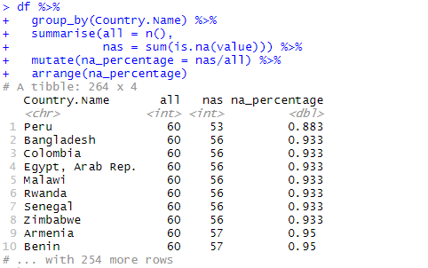
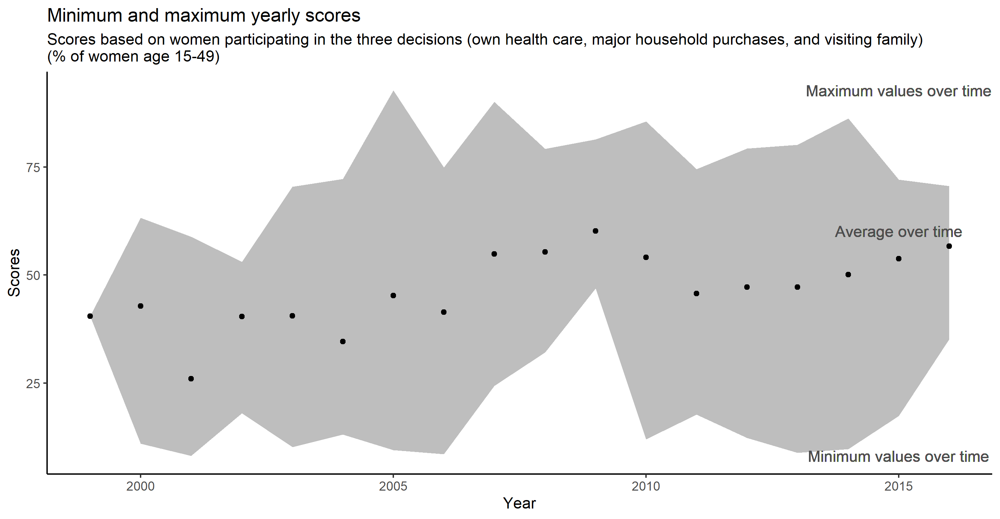

# Women making decisions

Data: https://data.worldbank.org/indicator/SG.DMK.ALLD.FN.ZS

I wanted to look at an interesting & public data, and I got interested in World Bank data about women's decision making.

Unfortunately, a large part of the data is NAs:

As a result, visualisations and analyses are very difficult.

A few notes nevertheless:

- After 2000s, the data is more rich (less NAs)
- I haven't found one country that could be plotted over tim

As no country shows a good enough data coverage, I displayed minimum and maximum values over time:

Overall, the decision making power increases over time which is good, but I get a feeling that the increase just before 2010 is a result of low data amounts rather than socio-economical issues being resolved.